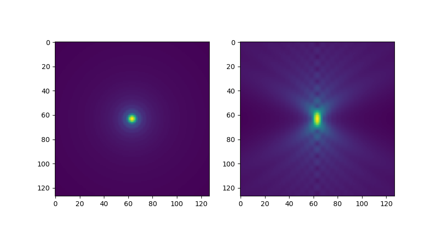

# psfmodels

[](https://pypi.org/project/psfmodels)
[](https://python.org)
[](https://github.com/tlambert03/psfmodels/actions/workflows/ci.yml)
[](https://codecov.io/gh/tlambert03/psfmodels)

Python bindings for scalar and vectorial models of the point spread function.

Original C++ code and MATLAB MEX bindings Copyright &copy; 2006-2013, [Francois
Aguet](http://www.francoisaguet.net/software.html), distributed under GPL-3.0
license. Python bindings by Talley Lambert

This package contains three models:

1. The vectorial model is described in Auget et al 2009<sup>1</sup>. For more
information and implementation details, see Francois' Thesis<sup>2</sup>.
2. A scalar model, based on Gibson & Lanni<sup>3</sup>.
3. A gaussian approximation (both paraxial and non-paraxial), using paramters from Zhang et al (2007)<sup>4</sup>.

<small>

<sup>1</sup> [F. Aguet et al., (2009) Opt. Express 17(8), pp.
6829-6848](https://doi.org/10.1364/OE.17.006829)

<sup>2</sup> [F. Aguet. (2009) Super-Resolution Fluorescence Microscopy Based on
Physical Models. Swiss Federal Institute of Technology Lausanne, EPFL Thesis no.
4418](http://bigwww.epfl.ch/publications/aguet0903.html)

<sup>3</sup> [F. Gibson and F. Lanni (1992) J. Opt. Soc. Am. A, vol. 9, no. 1, pp. 154-166](https://opg.optica.org/josaa/abstract.cfm?uri=josaa-9-1-154)

<sup>4</sup> [Zhang et al (2007). Appl Opt
. 2007 Apr 1;46(10):1819-29.](https://doi.org/10.1364/AO.46.001819)

</small>

### see also:

For a different (faster) scalar-based Gibson–Lanni PSF model, see the
[MicroscPSF](https://github.com/MicroscPSF) project, based on [Li et al
(2017)](https://doi.org/10.1364/JOSAA.34.001029) which has been implemented in
[Python](https://github.com/MicroscPSF/MicroscPSF-Py),
[MATLAB](https://github.com/MicroscPSF/MicroscPSF-Matlab), and
[ImageJ/Java](https://github.com/MicroscPSF/MicroscPSF-ImageJ)

## Install

```sh
pip install psfmodels
```

### from source

```sh
git clone https://github.com/tlambert03/PSFmodels.git
cd PSFmodels
pip install -e ".[dev]"  # will compile c code via pybind11
```

## Usage

There are two main functions in `psfmodels`: `vectorial_psf` and `scalar_psf`.
Additionally, each version has a helper function called `vectorial_psf_centered`
and `scalar_psf_centered` respectively. The main difference is that the `_psf`
functions accept a vector of Z positions `zv` (relative to coverslip) at which
PSF is calculated. As such, the point source may or may not actually be in the
center of the rendered volume. The `_psf_centered` variants, by contrast, do
_not_ accecpt `zv`, but rather accept `nz` (the number of z planes) and `dz`
(the z step size in microns), and always generates an output volume in which the
point source is positioned in the middle of the Z range, with planes equidistant
from each other. All functions accept an argument `pz`, specifying the position
of the point source relative to the coverslip. See additional keyword arguments
below

_Note, all output dimensions (`nx` and `nz`) should be odd._

```python
import psfmodels as psfm
import matplotlib.pyplot as plt
from matplotlib.colors import PowerNorm

# generate centered psf with a point source at `pz` microns from coverslip
# shape will be (127, 127, 127)
psf = psfm.make_psf(127, 127, dxy=0.05, dz=0.05, pz=0)
fig, (ax1, ax2) = plt.subplots(1, 2)
ax1.imshow(psf[nz//2], norm=PowerNorm(gamma=0.4))
ax2.imshow(psf[:, nx//2], norm=PowerNorm(gamma=0.4))
plt.show()
```



```python
# instead of nz and dz, you can directly specify a vector of z positions
import numpy as np

# generate 31 evenly spaced Z positions from -3 to 3 microns
psf = psfm.make_psf(np.linspace(-3, 3, 31), nx=127)
psf.shape  # (31, 127, 127)
```

**all** PSF functions accept the following parameters. Units should be provided
in microns unless otherwise stated. Python API may change slightly in the
future.  See function docstrings as well.

```
nx (int):       XY size of output PSF in pixels, must be odd.
dxy (float):    pixel size in sample space (microns) [default: 0.05]
pz (float):     depth of point source relative to coverslip (in microns) [default: 0]
ti0 (float):    working distance of the objective (microns) [default: 150.0]
ni0 (float):    immersion medium refractive index, design value [default: 1.515]
ni (float):     immersion medium refractive index, experimental value [default: 1.515]
tg0 (float):    coverslip thickness, design value (microns) [default: 170.0]
tg (float):     coverslip thickness, experimental value (microns) [default: 170.0]
ng0 (float):    coverslip refractive index, design value [default: 1.515]
ng (float):     coverslip refractive index, experimental value [default: 1.515]
ns (float):     sample refractive index [default: 1.47]
wvl (float):    emission wavelength (microns) [default: 0.6]
NA (float):     numerical aperture [default: 1.4]
```

## Comparison with other models

While these models are definitely slower than the one implemented in [Li et al
(2017)](https://doi.org/10.1364/JOSAA.34.001029) and
[MicroscPSF](https://github.com/MicroscPSF), there are some interesting
differences between the scalar and vectorial approximations, particularly with
higher NA lenses, non-ideal sample refractive index, and increasing spherical
aberration with depth from the coverslip.

For an interactive comparison, see the [examples.ipynb](notebooks/examples.ipynb) Jupyter
notebook.

## Lightsheet PSF utility function

The `psfmodels.tot_psf()` function provides a quick way to simulate the total
system PSF (excitation x detection) as might be observed on a light sheet
microscope (currently, only strictly orthogonal illumination and detection are
supported).  See the [lightsheet.ipynb](notebooks/lightsheet.ipynb) Jupyter notebook for
examples.
